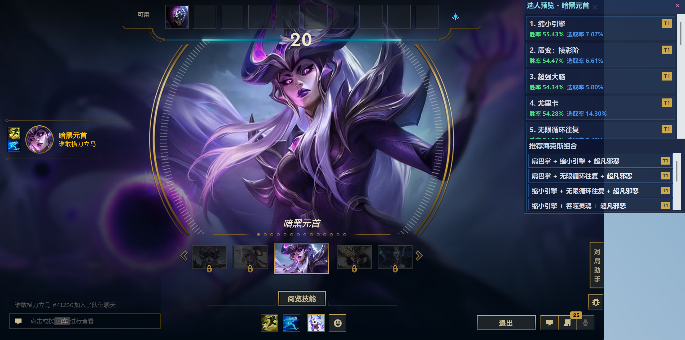
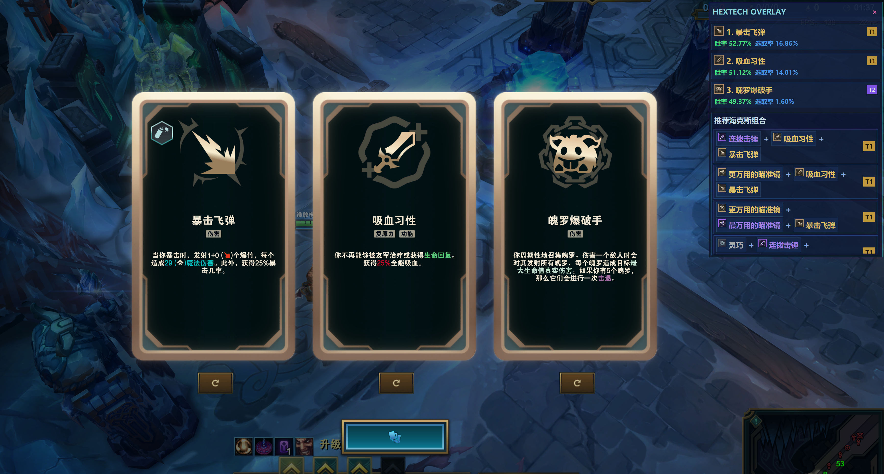



  <h1 align="center">
    
     
    PotatoHex
  </h1>

英雄联盟海克斯大乱斗助手。

根据英雄推荐海克斯组合，自动识别海克斯胜率与选取率。

## 预览

## 功能

- 根据当前英雄推荐海克斯强化组合
- 自动识别海克斯胜率、选取率

## 使用方法

1. 打开 `launcher.exe`
2. 点击 `启动`
3. 进入游戏后在海克斯大乱斗页面使用

## 注意事项

- 游戏窗口请使用无边框模式，不要使用全屏模式
- 首次启动可能会自动安装缺失依赖，软件会自行安装依赖包

## 文件说明

- `launcher.exe`: 启动器
- `main.exe`: 主程序
- `requirements.txt`: 依赖列表

## 说明

- 个人学习使用，禁止用于任何商业用途！使用本软件产生的任何后果由用户自行承担
